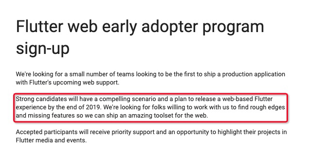
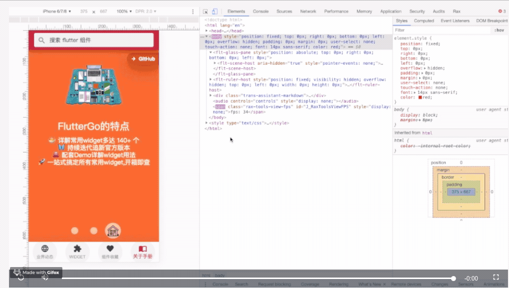
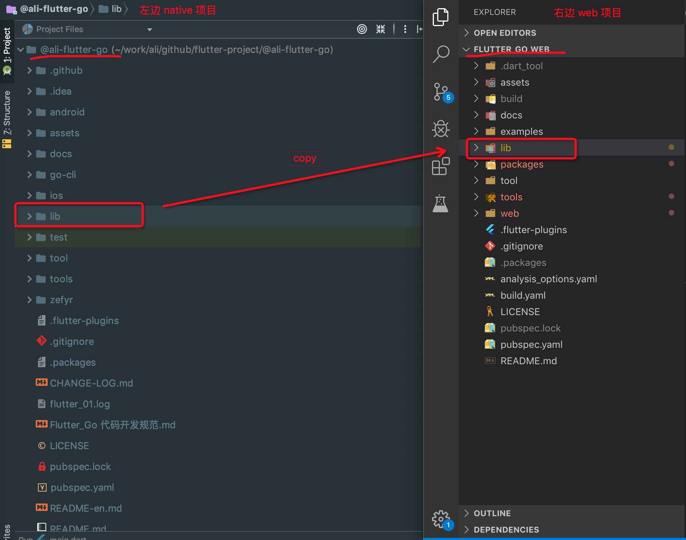
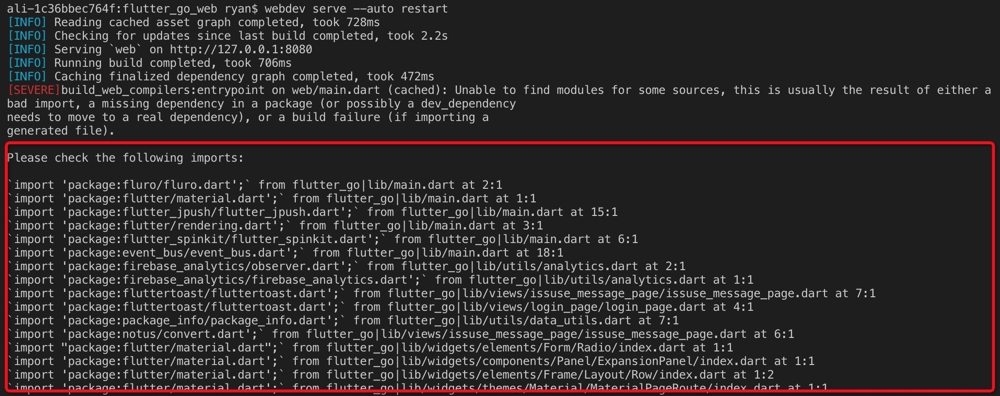
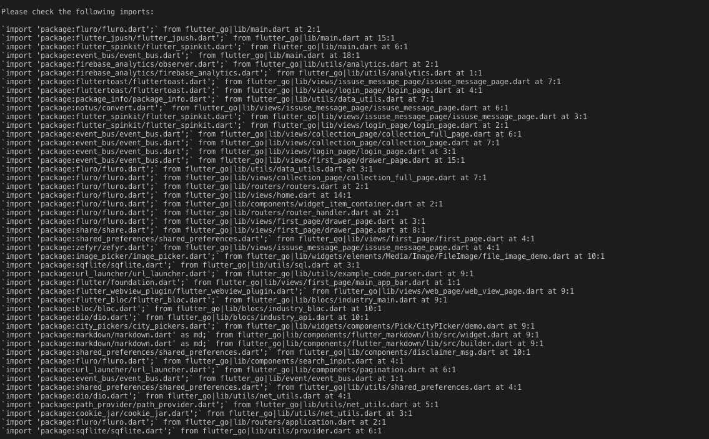

### 从 Flutter Go 到 Flutter Go web - 手把手带你轻松玩转 Flutter-web（一）

#### 背景
其实背景不多说, `Flutter for Web` 是 `Google大会` 伴随 Flutter 发布了1.5.4版本，同时也推出了Flutter for Web的预览版。
	
从5月后到目前（9月）业内对于 `Flutter for Web` 的观点，也是喜忧参半。
	
目前官方自述的问题包括一下内容：
-  Flutter for Web 还没有插件系统。暂时提供访问dart:html，dart:js，dart:svg，dart:indexed_db，只能使用其他网络库访问的浏览器的API
-  Flutter for Web 不能实现Flutter所有的 `Api`
-  Flutter for web 生成的代码可能运行缓慢，或者显示重要的UI `jank`
- 目前，桌面用户界面的互动并不齐全，因此 `flutter_web` 在PC浏览器上运行，运行的用户界面像手机APP一样
- 开发工作流程目前仅适用于Chrome( 笔者的 Safari 浏览器（版本 12.1.1）运行正常)

尽管 `Flutter for Web` 还有这样或者那样的问题，但是还好他只是 `预览版`, 未来可期，毕竟 `Google` 还是有无限可能。 同时笔者通过一些渠道了解到，`Flutter for Web`  年底还有大动作。
		
下面是 `Flutter` 官方的2019年，是“ Google的一个早期采用者计划 ”，其中提到：
“ 优秀的候选人将参与到引人注目的场景中，计划在2019年底将有一个基于 `Flutter web` 的体验发布 ”。		



#### 进入正题，给我一个beats，让我先 freestyle 一下 !
> 

#### 前言
笔者所在的团队之前开发了 `FLutter Go`  这个“ 帮助 FLutter 开发者快速上手的 APP ”，受到了一些 Flutter 入门开发者的认可。如果不了解这个项目请移步到 [这里](https://github.com/alibaba/flutter-go/tree/master)。

当 `FLutter Go` 遇到`Flutter for Web` ，如同牛奶遇到咖啡，我们必须做点什么.
- 第一：亲历`Flutter for Web` 到底如何；
- 第二：为需要从`Flutter native` 到  `Flutter-web` 的开发者，摸石头趟条路，毕竟从`native` 到 `web`，并不是一键生成的，还有许多坑要填。

> `Flutter-Go-Web`支持尚不稳定。我们将此版本指定为技术预览版; 对 `Flutter Go native` 版本移植还原度大概在 80%左右。旨在帮助 `Flutter` 开发人员，快速熟悉 `Flutter-web` 官方的实践。

>  [在 `Flutter` 官方宣布Flutter暂时不会开发热更新（Code push）](https://github.com/flutter/flutter/issues/14330) 之后, `Flutter-web` 无疑是的动态更新代码最快捷的方式,虽然不是最佳方案,但是是最易用降级方案。

> 通过 `Flutter-go-web` 版本的学习,可以快速，有效还原 `Flutter-go` native 版本。帮助开发者，对快速版本H5化,做一个样例展示，提供 `Flutter-web` 的能力演示。

- 线上展示地址
  - [Flutter GO 官网](https://flutter-go.pub)
  - [Flutter Go web 版本](https://flutter-go.pub/flutter_go_web/#FirstPage)




#### 准备
言归正传，开发前还是建议大家对 `Flutter-web` 有一个基本的了解。如果熟悉请忽略。
- [请了解 `Flutter-web` 官方说明](https://github.com/flutter/flutter_web/blob/master/README.md)
- [请了解 `Flutter-web` 的迁移指南](https://github.com/flutter/flutter_web/blob/master/docs/migration_guide.md)

#### 构建环境
##### 1. 安装 flutter_web 构建工具
>  输入命令从 https://pub.dev 的镜像拉取 webdev程序，webdev 类似于前端的构建工具
```dart
$ flutter pub global activate webdev
```
>  确保 $HOME/.pub-cache/bin 这个环境变量存在，环境变量在 vim ~/.bash_profile 里修改
```dart
// ~/.bash_profile 加上这句
$ export PATH="$PATH":"$HOME/.pub-cache/bin"
```
##### 2. 拉取 `flutter_web` 示例
> `Flutter-web`版本都是基于，web版本的 `packages` 包，所以要另起一个新的工程。
> 为了避免创建的不一致性，基于官方的 flutter_web 示例做更改
```dart
$ git clone https://github.com/flutter/flutter_web.git flutter_go_web
```
##### 3. 创建 `flutter_go_web` 项目
> 由于我们只有一个目标项目，所以可以删除 examples 目录，替换成 `Flutter Go`项目开发。
```dart
$ cd flutter_go_web
$ rm -rf examples
```
##### 4. 手动创建 `yaml` 文件
> 在项目根目录，需要创建两个关键的 `.yaml` 文件
> build.yaml 是发布版本的必要的配置
> pubspec.yaml 是所有依赖配置，类似于 webpack 里的 package.json
> 这两个配置内容分别如下：
```dart
# build.yaml
targets:
  $default:
    builders:
      build_web_compilers|entrypoint:
        # Avoid building the test directory.
        generate_for: ['web/**.dart']
        options:
          dart2js_args:
            - --no-source-maps
            - -O4
            - --fast-startup
            - --minify
            - --trust-primitives
            - --trust-type-annotations
```
```dart
# pubspec.yaml
name: flutter_go
description: flutter_go
environment:
  # You must be using Flutter >=1.5.0 or Dart >=2.3.0
  sdk: '>=2.3.0-dev.0.1 <3.0.0'

dependencies:
  flutter_web: any
  flutter_web_ui: any

dev_dependencies:
  build_runner: any
  build_web_compilers: any

# dependency_overrides 优先直接引用github上的packages
dependency_overrides:
  flutter_web:
    git:
      url: https://github.com/flutter/flutter_web
      path: packages/flutter_web
  flutter_web_test:
    git:
      url: https://github.com/flutter/flutter_web
      path: packages/flutter_web_test
  flutter_web_ui:
    git:
      url: https://github.com/flutter/flutter_web
      path: packages/flutter_web_ui
```
> 当然 `dependency_overrides` 你也可以配置成本地路径，但是为了保证依赖库的最新，还是用git上的比较好, 下面是本地路径的配置。
```dart
dependency_overrides:
  flutter_web:
    path: ./packages/flutter_web
  flutter_web_test:
    path: ./packages/flutter_web_test
  flutter_web_ui:
    path: ./packages/flutter_web_ui
```
##### 5. 更新 `packages` 包
```dart
$ flutter pub upgrade
! flutter_web 0.0.0 from path packages/flutter_web
! flutter_web_ui 0.0.0 from path packages/flutter_web_ui
Running "flutter pub upgrade" in hello_world... 5.0s
```

##### 6. 拷贝 `Flutter-go` 项目下的 libs  到`Flutter_go_web` 目录下


##### 7. 现在就可以使用 `webdev` 构建并启动开发服务器
```dart
$ webdev serve 
或者 webdev 与热重载一起使用
$ webdev serve --auto restart
```
```dart
[INFO] Reading cached asset graph completed, took 598ms
[INFO] Checking for updates since last build completed, took 2.1s
[INFO] Starting resource servers...
```
> 之后提示一直在连接中, 说明 缺少 `resource`  资源文件，继续下面操作
##### 7. 创建 `web` 入口
> 手动创建 `web` 文件夹，里面创建两个文件:
> `index.html` 为入口 `html` 页面
>  `main.dart` 为 `html` 引用文件
```vbscript-html
<!-- index.html-->
<!DOCTYPE html>
<html lang="en">
	<head>
	  <meta charset="UTF-8">
	  <title></title>
	  <script defer src="main.dart.js" type="application/javascript"></script>
	</head>
	<body>
	</body>
</html>
```
```dart
/// main.dart
import 'package:flutter_web_ui/ui.dart' as ui;
/// flutter_go 是项目名称，在pubspec.yaml 里已经设置
import 'package:flutter_go/main.dart' as app;
main() async {
  await ui.webOnlyInitializePlatform();
  app.main();
}
```
##### 8. 再次运行 `webdev` 编译并启动开发服务器
```dart
$ webdev serve --auto restart
```
> 本地服务器这样就能跑起来了！？先别忙，接下来报了如下一堆错误 ...

> 基本是依赖的 `Flutter-web`的核心库和第三方库，核心库需要替换的依赖大概如下：
``` dart
package:flutter/material.dart -> package:flutter_web/material.dart
package:flutter/widgets.dart -> package:flutter_web/widgets.dart
package:flutter/cupertino.dart -> package:flutter_web/cupertino.dart
package:flutter/services.dart -> package:flutter_web/services.dart
package:flutter/rendering.dart -> package:flutter_web/rendering.dart
package:flutter/gestures.dart -> package:flutter_web/gestures.dart
dart:ui -> package:flutter_web_ui/ui.dart
```

> 你可以一个个文件替换，不过笔者写了一个转换库`trans2fw`小工具，用一个命令就可以对【官方常用的代码库】转换成web版本，减少大家的开发成本。
> [trans2fw](https://github.com/ryan730/trans2fw) 是笔者开发的一个 自动化 flutter native 项目转化成 flutter-web 项目的工具，已经提交到 `pub` 镜像上。[github 地址>>>](https://github.com/ryan730/trans2fw) 
- 安装 `trans2fw` 工具, 并注册程序
```dart
  $ pub global activate trans2fw
  $ pub global run trans2fw
```

- 运行 `trans2fw` 工具,根据提示输入，安装完成后，基本按提示输入转换目录就可以了
```dart
$ trans2fw
[✓] 请输入需要转换的文件目录(相对于项目目录): lib
[✓] 是否覆盖原有文件 ?  (y/N) y
{path: lib, cover: true}
使用输入文件目录:lib
被转换的文件::lib/routers/application.dart::4
被转换的文件::lib/routers/routers.dart::4
被转换的文件::lib/routers/router_handler.dart::4
被转换的文件::lib/resources/icon_names.dart::3
被转换的文件::lib/resources/shared_preferences_keys.dart::3
被转换的文件::lib/resources/widget_name_to_icon.dart::3
被转换的文件::lib/standard_pages/index.dart::6
...
```
> 稍等片刻 ... 见证奇迹


##### 9. 再次运行 `webdev` 编译并启动开发服务器
```dart
$ webdev serve --auto restart
```
> what c... is your problem ?! 还有这么多... 别着急再仔细看，剩下的都是第三方库的依赖问题!
> 如果你自己的项目没有过大量的第三方库，也许已经运行起来了。
> 不要紧，咱们逐个解决。


#### 解决第三方库
> 总结一下都有哪些第三方库需要搞定：
- [ ] fluro 
- [ ]  flutter_jpush
- [ ] flutter_spinkit
- [ ]  event_bus
- [ ]  share
- [ ]  shared_preferences
- [ ]  zefyr
- [ ]  image_picker
- [ ] sqflite
- [ ] url_launcher
- [ ] flutter/foundation
- [ ]  flutter_webview_plugin
- [ ] flutter_bloc
- [ ] bloc
- [ ]  dio
- [ ] city_pickers
- [ ]  markdown
- [ ] path_provider
- [ ] cookie_jar
- [ ] sqflite

> 真的好多，怎么办，`Google 大法` 留的坑，目前只能自力更生了。
> 写到这里一看 iwatch ⌚️，已经凌晨了，一声 "哎我去" ...
> 篇幅有限，这些个问题我会在《从 Flutter Go 到 Flutter Go web - 手把手带你轻松玩转 Flutter-web（二）》做解答，如有兴趣敬请关注。
> [以上的案例的github地址>>>](https://github.com/alibaba/flutter-go/tree/web/flutter-go-web-0.0.1)

#### 最后
> 沉淀了数月，FlutterGo 终于迎来了第二次迭代更新！不仅新增个人中心的概念，还提供了第三方共建工具、并且，我们还完成了 FlutterGo web 版的开发。而这些~都在我们FlutterGo官网可见!!!

> [相关介绍](https://github.com/Nealyang/PersonalBlog/issues/52)

### 🔥 `Flutter Go 2.0` 即将发布
> Flutter Go 2.0 秉承年初发布的 [The Flutter-Go Roadmap（路线图） for 2019](https://github.com/alibaba/flutter-go#the-flutter-go-roadmap%E8%B7%AF%E7%BA%BF%E5%9B%BE-for-2019) 已经做了新版本的迭代，新版本如下新功能:

<h6>注：✔是本次发布内容</h6>

- [x] [ `Flutter Go` 官方网站 ](https://flutter-go.pub/website/) (官方消息，发布，学习)
- [x] [ `Flutter Go web` 版本](https://github.com/alibaba/flutter-go/tree/web/flutter-go-web-0.0.1) (web 版本学习帮助)
    - [线上预览版 ](https://flutter-go.pub/flutter_go_web/)
    - [项目地址 ](https://github.com/alibaba/flutter-go/tree/web/flutter-go-web-0.0.1)

- [x] [ `Flutter Go Widget` 的 `pull request`  提交规范（第三方共建）](https://github.com/alibaba/flutter-go/blob/master/docs/contribute.md)

- [x] 用户中心 (专属个人的`widget`案例)
	- 用户登录（通过`GitHub`账户）
	- 全网搜索 （全网搜索 `Flutter` 资讯)
	- 收藏个人组件（保存到远端）
	- 反馈建议 （APP 在线 `ISSUES`）
	- 分享链接 （APP分享）
- [x] [ `go-cli` 工具 ](https://github.com/alibaba/flutter-go/blob/master/docs/widget.md)
	-  `Flutter Go` 的 `pull request` 工具
	-  [命令行 生成 `Flutter Go Widget` 标准公共模版](https://github.com/alibaba/flutter-go/blob/beta/docs/widget.md)
	-  `markdown` 模版动态化生成（合并到master分支后）
- [x] ` Flutter Go ` 官方 `APP` 版本自动升级

#### 三方共建说明
 
由于 **flutter** 内容更新较快. 我们无法更快的丰富项目的内容. 如果您愿意为国内flutter的发展与学习贡献自己的力量, 请参考我们的 [共建说明](https://github.com/alibaba/flutter-go/blob/master/docs/contribute.md), 我们会将共建者的头像姓名贡献至我们的官网. 
